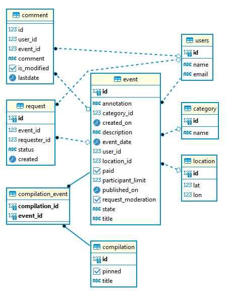

# java-explore-with-me
## ExploreWithMe (англ. «исследуй со мной»).
Позволяет пользователям делиться информацией об интересных событиях 
и находить компанию для участия в них.

### Состоит из двух сервисов:
- Основной сервис
- Сервис статистики

### Основной сервис:

Содержит все необходимое для работы продукта. API сервиса разделено на три части:
* **Публичная:**
  * /compilations GET - Получение подборок событий
  * /compilations/{compId} GET - Получение подборки событий по его id
  * /categories GET - Получение категорий
  * /categories/{catId} GET - Получение информации о категории по её идентификатору
  * /events GET - Получение событий с возможностью фильтрации
  * /events/{eventId} GET - Получение подробной информации об опубликованном событии по его идентификатору
* **Закрытая:**
  * /users/{userId}/events GET - Получение событий, добавленных текущим пользователем
  * /users/{userId}/events POST - Добавление нового события
  * /users/{userId}/events/{eventId} GET - Получение полной информации о событии добавленном текущим пользователем
  * /users/{userId}/events/{eventId} PATCH - Изменение события добавленного текущим пользователем
  * /users/{userId}/events/{eventId}/requests GET - Получение информации о запросах на участие в событии текущего пользователя
  * /users/{userId}/events/{eventId}/requests PATCH - Изменение статуса (подтверждена, отменена) заявок на участие в событии текущего пользователя
  * /users/{userId}/requests GET - Получение информации о заявках текущего пользователя на участие в чужих событиях
  * /users/{userId}/requests POST - Добавление запроса от текущего пользователя на участие в событии
  * /users/{userId}/requests/{requestId}/cancel PATCH - Отмена своего запроса на участие в событии
* **Административная:**
  * /admin/categories POST - Добавление новой категории
  * /admin/categories/{catId} DELETE - Удаление категории
  * /admin/categories/{catId} PATCH - Изменение категории
  * /admin/events GET - Поиск событий
  * /admin/events/{eventId} PATCH - Редактирование данных события и его статуса (отклонение/публикация).
  * /admin/users GET - Получение информации о пользователях
  * /admin/users POST - Добавление нового пользователя
  * /admin/users/{userId} DELETE - Удаление пользователя
  * /admin/compilations POST - Добавление новой подборки (подборка может не содержать событий)
  * /admin/compilations/{compId} DELETE - Удаление подборки
  * /admin/compilations/{compId} PATCH - Обновить информацию о подборке

**Схема БД:** 

### Сервис статистики:

Собирает информацию о количестве обращений пользователей к спискам событий и, во-вторых, о количестве запросов к подробной информации о событии.
На основе этой информации формируется статистика о работе приложения.

**API**: 
* /hit POST - Сохранение информации о том, что к эндпоинту был запрос
* /stats GET - Получение статистики по посещениям

### Дополнительная функциональность: Комментарии 
API разделено на 3 части: 
* **Публичная:**
  * /events/{eventId}/comments GET - Получение комментариев по событию
* **Закрытая:**
  * /users/{userId}/comments GET - Получение своих комментариев по всем событиям
  * /users/{userId}/event/{eventId}/comments POST - Создание комментария к событию
  * /users/{userId}/event/{eventId}/comments PATCH - Изменение ранее оставленного комментария
  * /users/{userId}/event/{eventId}/comments DELETE - Удаление комментария
* **Административная:**
  * /admin/comments/{commentId} GET - Получение комментария по id
  * /admin/comments/{commentId} PATCH - Изменение комментария
  * /admin/comments/{commentId} DELETE - Удаление комментария

[Ссылка на PR](https://github.com/elayhan/java-explore-with-me/pull/3)